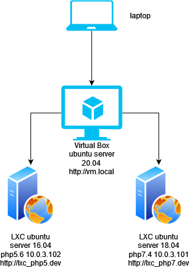
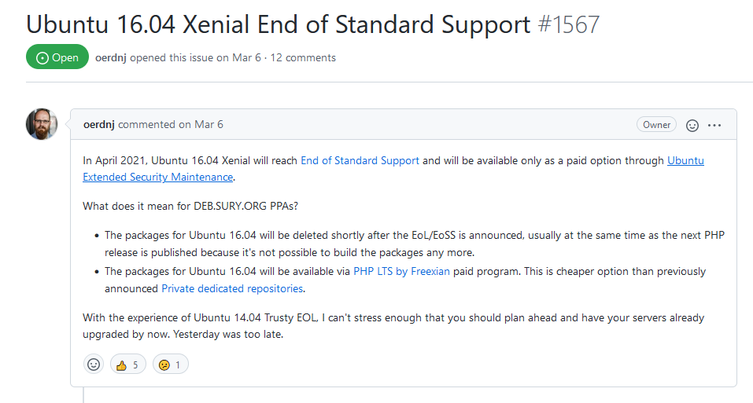
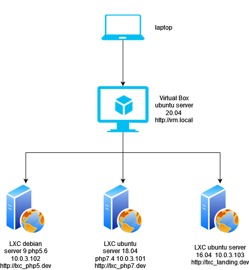

# Soal Praktikum Modul 1 Virtualisasi
## Keadaan

Gilang dan Adit adalah sysadmin junior pada suatu perusahaan. Perusahaan tersebut akan membuat sebuah website company profile. Dimana website tersebut berisi 3 hal, yaitu company profile, blog dan aplikasi. CTO menjelaskan strategi domain yang akan digunakan, yaitu:

- vm.local
  - berisi landing page
- vm.local/blog
  - berisi blog
- vm.local/app
  - berisi aplikasi perusahaan

Setelah mendengarkan strategi domain dari CTO, Mereka mencoba membuat virtualisasi sederhana dengan skema dibawah ini :

Dari skema diatas, mereka mementukan bahwa lxc_php5.dev akan digunakan sebagai server aplikasi dan lxc_php7.dev akan digunakan sebagai server blog dan vm.local digunakan sebagai proxy server serta untuk web landing page. Lantas, mereka bertemu dengan tim programmer. Tim Programmer memberi tahu kepada mereka bahwa ada perubahan baru baru ini terkait ubuntu 16.04.

Karena hal ini, mereka berdiskusi dengan tim programmer dan menghasilkan suatu keputusan dimana skema yang akan dibuat adalah:

## Soal Praktikum

Dari skema diatas maka mereka akan melakukan pekerjaan sebagai berikut :

1. Rename ubuntu_php5.6 menjadi ubuntu_landing

2. Install lxc debian 9 dengan nama debian_php5.6

3. setup nginx pada debian_php5.6 untuk domain http://lxc_php5.dev , buat halaman index.html yang menerangkan informasi nama lxc

4. setup nginx pada ubuntu_landing untuk domain http://lxc_landing.dev , buat halaman index.html yang menerangkan informasi nama lxc

5. LXC ubuntu_landing harus auto start ketika vm dinyalakan, hal ini digunakan untuk menjaga agar website company profile tidak mengalami *downtime*

6. setup nginx pada vm.local untuk mengatur *proxy_pass* dimana :

   - mengakses http://vm.local akan diarahkan ke http://lxc_landing.dev
   - mengakses http://vm.local/blog akan diarahkan ke http://lxc_php7.dev
   - mengakses http://vm.local/app akan diartahkan ke http://lxc_php5.dev

7. untuk kebutuhan presentasi mereka, browser di laptop mereka harus dapat mengakses ketiga url tersebut.

8. Menyiapkan analisa untuk diserahkan ke CTO

   - mengapa untuk kebutuhan php5.6 tidak bisa menggunakan ubuntu 16.04, sehingga perlu diganti os ke debian 9?

   - kenapa harus menggunakan virtualisasi LXC pada skema website yang akan didevelop?
   - apa yang dimaksud dengan proxy server? kenapa vm.local bisa kita anggap sebagai proxy server?

## Bentuk Laporan Praktikum

1. Laporan Praktikum dikumpulkan dalam bentuk dokumentasi di github dengan format markdown, berisi langkah langkah dalam penyelesaian soal nomor 1 hingga nomor 7, serta berikan analisa kalian berdasarkan data dan opini kalian masing masing.
2. Laporan Praktikum menggunakan bahasa indonesia yang baik dan benar, apabila menggunakan bahasa inggris akan menjadi poin plus (dapat menambahkan nilai pada poin poin yang kurang) .
3. Link url Laporan Praktikum dikumpulkan di elearning paling lambat sabtu (cek elearning masing masing)
4. Responsi dilakukan pada minggu selanjutnya, dimana praktikan menjawab pertanyaan yang diberikan oleh penguji.
5. Ketahuan copy paste, mengambil gambar langkah langkah dari kelompok lain, makan nilai auto 0 dan tidak berhak meminta remidi.

