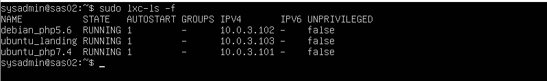
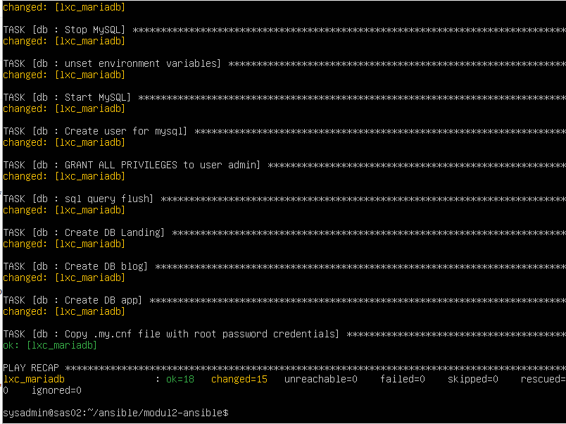

# Modul 2 - Automasi

## Dasar Teori

### Ansible

Ansible adalah sebuah provisioning tool yang dikembangkan oleh  RedHat. Dimana kamu dapat mencatat setiap proses deployment ataupun  konfigurasi yang biasa dilakukan berulang - ulang terhadap beberapa  server. Misal saat pertama kali kita memasang Ubuntu Server di 10 mesin, maka kita akan melakuan apt-get update serta memasang beberapa komponen seperti PHP5 dan Apache2. Sebenarnya tidak akan menjadi masalah, bila  kita hanya melakukan sedikit hal. Tapi bayangkan bila harus melakukan  konfigurasi yang cukup kompleks dan dilakukan secara berulang - ulang ke 10 mesin tersebut.

## Pra - Instalasi

- Setup semua lxc menjadi autostart ketika vm dinyalakan

  

- Masuk ke LXC

  ```bash
  sudo lxc-attach -n debian_php5.6
  ```

- Install openssh-server & python

  ```bash
  sudo apt install openssh-server python
  ```

- Config ssh untuk enable root user

  ```bash
  cd /etc/ssh
  nano sshd_config
  
  # setting config menjadi
  PermitRootLogin yes
  RSAAuthentication yes
  ```

  

- Restart ssh service

  ```bash
  sudo service sshd restart
  ```

- Setting password root

  ```bash
  passwd
  ```

- Akses LXC melalui SSH

  ```bash
  # jika masih di dalam lxc, silahkan di exit dulu
  
  ssh root@lxc_php5.dev
  ```

  

- Keluar dari ssh

  ```bash
  # bisa dengan menekan ctrl + D
  # atau menulis command
  exit
  ```
  
- Lakukan configurasi ini pada semua lxc

## Instalasi

- Pada VM ubuntu server 20.04, install ansible

  ```bash
  sudo apt install ansible sshpass
  ```

## Getting started with Infrastructur as Code

### Cek Koneksi Semua LXC menggunakan Ansible

1. Buat folder simple-playbook pada ~/ansible/

   ```bash
   mkdir -p ~/ansible/simple-playbook
   ```

2. Pindah ke folder simple-playbook

   ```bash
   cd ~/ansible/simple-playbook
   ```

3. Buat file `hosts` sebagai vagrant inventory, dengan isi:

   ```bash
   ubuntu_landing ansible_host=lxc_landing.dev ansible_ssh_user=root ansible_become_pass=a
   debian_php5 ansible_host=lxc_php5.dev ansible_ssh_user=root ansible_become_pass=a
   ubuntu_php7 ansible_host=lxc_php7.dev ansible_ssh_user=root ansible_become_pass=a
   ```

   Keterangan syntax:

   ```bash
   nama_host ansible_host=[IP/DOMAIN] ansible_ssh_user=[UserName] ansible_become_pass=[password user]
   ```

4. Berikutnya jalankan perintah:

   ```bash
   ansible -i hosts -m ping all -k
   ```

   

   Keterangan:

   1. Parameter -i digunakan untuk digunakan untuk mendeclare ansible inventory.
   2. Parameter -m digunakan untuk declare module command
   3. Parameter all digunakan untuk penanda ansible dijalankan di host mana. Parameter all bisa diganti dengan nama host.
   4. Parameter -k digunakan untuk menanyakan password login ssh

### Menjalankan shell command menggunakan ansible

1. Jalankan perintah

   ```bash
   ansible -i ./hosts -m shell -a 'uname -a' all -k
   ```

   

## Grouping Host

1. Buka file `hosts` dan tambahkan nama group. Contoh nama groupnya adalah php5 dan php7

   ```bash
   [php5]
   ubuntu_landing ansible_host=lxc_landing.dev ansible_ssh_user=root ansible_become_pass=a
   debian_php5 ansible_host=lxc_php5.dev ansible_ssh_user=root ansible_become_pass=a
   
   [php7]
   ubuntu_php7 ansible_host=lxc_php7.dev ansible_ssh_user=root ansible_become_pass=a
   ```

2. Buat file `install-lynx.yml` dengan isi sebagai berikut

   ```yaml
     - hosts: php5
       tasks:
         - name: Install lynx
           become: yes #untuk menjadi superuser
           apt: name={{ item }} state=latest update_cache=true
           with_items:
             - lynx
   ```

3. Jalankan Perintah

   ```bash
    ansible-playbook -i hosts install-lynx.yml -k
   ```

4. Hasil

   

5. Cek ke lxc group php5, apakah sudah terinstall

   

   

### Copy File

1. Buat file copy.yml, dengan isi

   ```yaml
   - hosts: php5
     tasks:
       - name: Buat folder /tmp/dari-host 
         command: mkdir -p /tmp/dari-host
       - name: Copy file install-lynx.yml
         copy: src=./install-lynx.yml dest=/tmp/dari-host/install-lynx.yml
   ```

2. Jalankan dengan perintah

   ```bash
    ansible-playbook -i hosts copy.yml -k
   ```

   

3. Cek ke lxc group php5, apakah sudah terinstall

   

   

   

## Referensi

1. https://github.com/leucos/ansible-tuto
2. https://github.com/fathoniadi/cloud-2018/tree/master/ansible
3. https://www.youtube.com/watch?v=f6cKT0aylDo

## Warning !!!

Untuk mengantisipasi hal yang tidak diinginkan (Ingat LXC digunakan sampai modul 5) silahkan backup semua lxc menggunakan command:

```bash
lxc-stop -n ubuntu_landing
lxc-copy -n ubuntu_landing -N ubuntu_landing_backup -sKD

# jangan lupa untuk mematikan auto start di config lxc backup
```


## Soal Latihan Praktikum (*DIWYOR*)

**Do It With Your Own Risk xixixi.**

1. Buat SQL Server dengan lxc baru bernama lxc_mariadb, gunakan ansible untuk instalasi dan konfigurasi mariadb serta phpmyadmin.

   - Setup LXC lxc_mariadb

     ```bash
     sudo lxc-create -n lxc_mariadb -t download -- --dist ubuntu --release bionic --arch amd64 --force-cache --no-validate --server images.linuxcontainers.org
     
     sudo lxc-start -n lxc_mariadb
     ```

   - Set IP static lxc_mariadb 10.0.3.200

     ```bash
     sudo lxc-attach -n lxc_mariadb
     apt update; apt upgrade -y; apt install -y nano
     ```

     

     ```bash
     netplan apply
     ```

   - Konfigurasi ssh server untuk lxc_mariadb

     ```bash
     apt install openssh-server
     nano /etc/ssh/sshd_config
     
     # setting config menjadi
     PermitRootLogin yes
     RSAAuthentication yes
     
     # end of config
     service sshd restart
     ```

   - Set password lxc_mariadb

     ```bash
     passwd
     ```

   - Setting autostart lxc_mariadb

     ```bash
     exit
     sudo su
     cd /var/lib/lxc/lxc_mariadb
     nano config
     ```

   - Jangan lupa dibackup dulu :)

   - Daftar kan domain lxc_mariadb ke /etc/hosts

     ```bash
     sudo nano /etc/hosts
     ```

     

   - Buat ansible untuk install dan  konfigurasi mariadb 

     - Buat folder baru untuk mengerjakan ansible soal -latihan

       ```bash
       cd ~/ansible
       mkdir modul2-ansible
       cd modul2-ansible
       ```

     - Buat file hosts yang berisi:

       ```bash
       [php5]
       ubuntu_landing ansible_host=lxc_landing.dev ansible_ssh_user=root ansible_become_pass=a
       debian_php5 ansible_host=lxc_php5.dev ansible_ssh_user=root ansible_become_pass=a
       
       [php7]
       ubuntu_php7 ansible_host=lxc_php7.dev ansible_ssh_user=root ansible_become_pass=a
       
       [database]
       lxc_mariadb ansible_host=lxc_mariadb.dev ansible_ssh_user=root ansible_become_pass=a
       ```

     - Membuat install-mariadb.yml, yang berisi

       ```yaml
       - hosts: database
         vars:
           username: 'admin'
           password: 'SysAdminSas0102'
         roles:
           - { role: db }
       ```

     - Disini kita akan membuat roles yang bernama `db` . roles ini berisi kumpulan task instalasi dan konfigurasi mariadb

       ```bash
       mkdir -p roles/db
       ```

     - Didalam folder `roles/db` terdapat beberapa folder, yakni `handlers`, `tasks` dan `templates`. Folder `handlers` berisi perintah perintah untuk menjalankan mariadb seperti restart, sedangkan folder `tasks` berisi script instalasi mariadb dan folder `templates` berisi template konfigurasi untuk mariadb.

       ```bash
       mkdir -p roles/db/handlers
       mkdir -p roles/db/tasks
       mkdir -p roles/db/templates
       ```

     - Membuat script instalasi pada folder `tasks`.

       ```bash
       cd roles/db/tasks
       nano main.yml
       ```

     - roles/db/tasks/main.yml akan berisi:

       ```yaml
       ---
       - name: delete apt chache
         become: yes
         become_user: root
         become_method: su
         command: rm -vf /var/lib/apt/lists/*
       
       - name: install mariadb
         become: yes
         become_user: root
         become_method: su
         apt: name={{ item }} state=latest update_cache=true
         with_items:
          - python
          - mariadb-server
          - python-mysqldb
          - python-pymysql
       
       - name: Stop MySQL
         service: name=mysqld state=stopped
         
       - name: set environment variables
         shell: systemctl set-environment MYSQLD_OPTS="--skip-grant-tables"
         
       - name: Start MySQL
         service: name=mysqld state=started
         
       - name: sql query
         command:  mysql -u root --execute="UPDATE mysql.user SET authentication_string = PASSWORD('{{ password }}') WHERE User = 'root' AND Host = 'localhost';"
         
       - name: sql query flush
         command:  mysql -u root --execute="FLUSH PRIVILEGES"
         
       - name: Stop MySQL
         service: name=mysqld state=stopped
         
       - name: unset environment variables
         shell: systemctl unset-environment MYSQLD_OPTS
         
       - name: Start MySQL
         service: name=mysqld state=started
         
       - name: Create user for mysql
         command:  mysql -u root --execute="CREATE USER IF NOT EXISTS '{{ username }}'@'localhost' IDENTIFIED BY '{{ password }}';"
       
       - name: GRANT ALL PRIVILEGES to user {{username}}
         command:  mysql -u root --execute="GRANT ALL PRIVILEGES ON * . * TO '{{ username }}'@'localhost';;"
         
       - name: sql query flush
         command:  mysql -u root --execute="FLUSH PRIVILEGES"
         
       - name: Create DB Landing
         command:  mysql -u root --execute="CREATE DATABASE IF NOT EXISTS `landing`;"
       
       - name: Create DB blog
         command:  mysql -u root --execute="CREATE DATABASE IF NOT EXISTS `blog`;"
       
       - name: Create DB app
         command:  mysql -u root --execute="CREATE DATABASE IF NOT EXISTS `app`;"
       
       - name: Copy .my.cnf file with root password credentials
         template: 
           src=templates/my.cnf 
           dest=/etc/mysql/mariadb.conf.d/50-server.cnf
         notify: restart mysql
       ```
       
     - roles/db/templates/my.cnf akan berisi:
     
       ```ini
       #
       # These groups are read by MariaDB server.
       # Use it for options that only the server (but not clients) should see
       #
       # See the examples of server my.cnf files in /usr/share/mysql/
       #
       
       # this is read by the standalone daemon and embedded servers
       [server]
       
       # this is only for the mysqld standalone daemon
       [mysqld]
       
       #
       # * Basic Settings
       #
       user		= mysql
       pid-file	= /var/run/mysqld/mysqld.pid
       socket		= /var/run/mysqld/mysqld.sock
       port		= 3306
       basedir		= /usr
       datadir		= /var/lib/mysql
       tmpdir		= /tmp
       lc-messages-dir	= /usr/share/mysql
       skip-external-locking
       
       # Instead of skip-networking the default is now to listen only on
       # localhost which is more compatible and is not less secure.
       bind-address		= 0.0.0.0
       
       #
       # * Fine Tuning
       #
       key_buffer_size		= 16M
       max_allowed_packet	= 16M
       thread_stack		= 192K
       thread_cache_size       = 8
       # This replaces the startup script and checks MyISAM tables if needed
       # the first time they are touched
       myisam_recover_options  = BACKUP
       #max_connections        = 100
       #table_cache            = 64
       #thread_concurrency     = 10
       
       #
       # * Query Cache Configuration
       #
       query_cache_limit	= 1M
       query_cache_size        = 16M
       
       #
       # * Logging and Replication
       #
       # Both location gets rotated by the cronjob.
       # Be aware that this log type is a performance killer.
       # As of 5.1 you can enable the log at runtime!
       #general_log_file        = /var/log/mysql/mysql.log
       #general_log             = 1
       #
       # Error log - should be very few entries.
       #
       log_error = /var/log/mysql/error.log
       #
       # Enable the slow query log to see queries with especially long duration
       #slow_query_log_file	= /var/log/mysql/mariadb-slow.log
       #long_query_time = 10
       #log_slow_rate_limit	= 1000
       #log_slow_verbosity	= query_plan
       #log-queries-not-using-indexes
       #
       # The following can be used as easy to replay backup logs or for replication.
       # note: if you are setting up a replication slave, see README.Debian about
       #       other settings you may need to change.
       #server-id		= 1
       #log_bin			= /var/log/mysql/mysql-bin.log
       expire_logs_days	= 10
       max_binlog_size   = 100M
       #binlog_do_db		= include_database_name
       #binlog_ignore_db	= exclude_database_name
       
       #
       # * InnoDB
       #
       # InnoDB is enabled by default with a 10MB datafile in /var/lib/mysql/.
       # Read the manual for more InnoDB related options. There are many!
       
       #
       # * Security Features
       #
       # Read the manual, too, if you want chroot!
       # chroot = /var/lib/mysql/
       #
       # For generating SSL certificates you can use for example the GUI tool "tinyca".
       #
       # ssl-ca=/etc/mysql/cacert.pem
       # ssl-cert=/etc/mysql/server-cert.pem
       # ssl-key=/etc/mysql/server-key.pem
       #
       # Accept only connections using the latest and most secure TLS protocol version.
       # ..when MariaDB is compiled with OpenSSL:
       # ssl-cipher=TLSv1.2
       # ..when MariaDB is compiled with YaSSL (default in Debian):
       # ssl=on
       
       #
       # * Character sets
       #
       # MySQL/MariaDB default is Latin1, but in Debian we rather default to the full
       # utf8 4-byte character set. See also client.cnf
       #
       character-set-server  = utf8mb4
       collation-server      = utf8mb4_general_ci
       
       #
       # * Unix socket authentication plugin is built-in since 10.0.22-6
       #
       # Needed so the root database user can authenticate without a password but
       # only when running as the unix root user.
       #
       # Also available for other users if required.
       # See https://mariadb.com/kb/en/unix_socket-authentication-plugin/
       
       # this is only for embedded server
       [embedded]
       
       # This group is only read by MariaDB servers, not by MySQL.
       # If you use the same .cnf file for MySQL and MariaDB,
       # you can put MariaDB-only options here
       [mariadb]
       
       # This group is only read by MariaDB-10.1 servers.
       # If you use the same .cnf file for MariaDB of different versions,
       # use this group for options that older servers don't understand
       [mariadb-10.1]
       ```
     
     - roles/db/handlers/main.yml akan berisi:
     
       ```yaml
       ---
       - name: restart mysql
         become: yes
         become_user: root
         become_method: su
         action: service name=mysql state=restarted
       ```
     
     - Jalankan perintah
     
       ```bash
       cd ~/ansible/modul2-ansible
       ansible-playbook -i hosts install-mariadb.yml -k
       ```
     
       
       
     - Check apakah db sudah terinstall
     
       ```bash
       ssh root@lxc_mariadb.dev
       
       mysql -u admin -p
       show databases;
       ```
     
       
     
   - Setup ansible nginx untuk mengakses phpmyadmin
   
     - Edit install-mariadb.yml menjadi :
   
       ```bash
       - hosts: database
         vars:
           username: 'admin'
           password: 'SysAdminSas0102'
           domain: 'lxc_mariadb.dev'
         roles:
           - db
           - pma
       ```
   
     - Disini kita akan membuat roles yang bernama `pma` . roles ini berisi kumpulan task instalasi dan konfigurasi phpmyadmin
   
       ```bash
       mkdir -p roles/pma
       ```
   
     - Didalam folder `roles/pma` terdapat beberapa folder, yakni `handlers`, `tasks` dan `templates`. Folder `handlers` berisi perintah perintah untuk menjalankan nginx dan php seperti restart, sedangkan folder `tasks` berisi script instalasi phpmyadmin dan folder `templates` berisi template konfigurasi untuk nginx.
   
       ```bash
       mkdir -p roles/pma/tasks
       mkdir -p roles/pma/handlers
       mkdir -p roles/pma/templates
       ```
   
     - roles/pma/tasks/main.yml akan berisi:
   
       ```yaml
       ---
       - name: delete apt chache
         become: yes
         become_user: root
         become_method: su
         command: rm -vf /var/lib/apt/lists/*
       
       - name: install nginx phpmyadmin
         become: yes
         become_user: root
         become_method: su
         apt: name={{ item }} state=latest update_cache=true
         with_items:
           - curl
           - nginx
           - nginx-extras
           - php7.2-fpm
           - php-mbstring
           - php-zip
           - php-gd
           - php-json
           - php-curl
           - phpmyadmin
       
       - name: enable module php mbstring
         command: phpenmod mbstring
         notify:
           - restart php
       
       - name: Copy pma.local
         template:
           src=templates/pma.local
           dest=/etc/nginx/sites-available/{{ domain }}
         vars:
           servername: '{{ domain }}'
       
       - name: Symlink pma.local
         command: ln -sfn /etc/nginx/sites-available/{{ domain }} /etc/nginx/sites-enabled/{{ domain }}
         notify:
           - stop apache2
           - restart nginx
       
       - name: Write {{ domain }} to /etc/hosts
         lineinfile:
           dest: /etc/hosts
           regexp: '.*{{ domain }}$'
           line: "127.0.0.1 {{ domain }}"
           state: present
       ```
       
     - roles/pma/templates/pma.local akan berisi:
     
     ```ini
       server {
         listen 80;
       
           server_name {{servername}};
       
           root /usr/share/phpmyadmin;
       
           index index.php;
       
           location / {
       
                try_files $uri $uri/ @phpmyadmin;
       
        	}
       	location @phpmyadmin {
                   fastcgi_pass unix:/run/php/php7.2-fpm.sock;   #Sesuaikan dengan versi PHP
       
                   fastcgi_param SCRIPT_FILENAME /usr/share/phpmyadmin/index.php;
       
                   include /etc/nginx/fastcgi_params;
       
                   fastcgi_param SCRIPT_NAME /index.php;
           }
           location ~ \.php$ {
       
                   fastcgi_pass unix:/run/php/php7.2-fpm.sock;  #Sesuaikan dengan versi PHP
       
                   fastcgi_index index.php;
       
                   fastcgi_param SCRIPT_FILENAME /usr/share/phpmyadmin$fastcgi_script_name;
       
                   include fastcgi_params;
       
           }
       }
     ```
     
     - roles/pma/handlers/main.yml akan berisi:
     
     ```yaml
       ---
       - name: stop apache2
         become: yes
         become_user: root
         become_method: su
         action: service name=apache2 state=stopped
       
       - name: restart nginx
         become: yes
         become_user: root
         become_method: su
         action: service name=nginx state=restarted
       
       - name: restart php
         become: yes
         become_user: root
         become_method: su
         action: service name=php7.2-fpm state=restarted
       
     ```
     
     - Jalankan perintah:
     
     ```bash
       cd ~/ansible/modul2-ansible
     ansible-playbook -i hosts install-mariadb.yml -k
     ```
     
     - edit /etc/nginx/sites-available/vm.local menjadi:
     
     ```ini
        server {
             listen 80;
               listen [::]:80;
       
               server_name vm.local;
       
               root /var/www/html;
               index index.html;
       
               location /php5 {
                       rewrite /php5/?(.*)$ /$1 break;
                       proxy_pass http://lxc_php5.dev;
               }
       
               location /php7 {
                       rewrite /php7/?(.*)$ /$1 break;
                       proxy_pass http://lxc_php7.dev;
               }
       
               location /phpmyadmin {
                       rewrite /phpmyadmin/?(.*)$ /$1 break;
                       proxy_pass http://lxc_mariadb.dev;
               }
               
               location / {
                       #rewrite /php7/?(.*)$ /$1 break;
                       proxy_pass http://lxc_landing.dev;
               }
       
       }
     ```
     
     - coba akses vm.local/phpmyadmin/:
     
     
     
     
   
2. Install codeigniter pada lxc_landing.dev dengan beberapa requirement, yakni:

   - Menggunakan PHP5, dikonfigurasikan dengan ansible dan konfigurasikan ansible untuk menginstal php5.6 digroup php5

   - Clone Codeigniter dari https://github.com/aldonesia/sas-ci

   - Menggunakan database landing yang terdapat pada lxc_mariadb

     Jawab

     1. Membuat roles instalasi php5

        - Buat file install-php5.yml

        - Disini kita akan membuat roles yang bernama `php5` . roles ini berisi kumpulan task instalasi dan konfigurasi phpmyadmin

        - Didalam folder `roles/php5` terdapat beberapa folder, yakni `handlers`, `tasks` dan `templates`. Folder `handlers` berisi perintah perintah untuk menjalankan nginx dan php seperti restart, sedangkan folder `tasks` berisi script instalasi phpmyadmin dan folder `templates` berisi template konfigurasi untuk nginx.

        - roles/php5/tasks/main.yml akan berisi:

          ```yaml
          ---
          - name: delete apt chache
            become: yes
            become_user: root
            become_method: su
            command: rm -vf /var/lib/apt/lists/*
          
          - name: install requirement dpkg to install php5
            become: yes
            become_user: root
            become_method: su
            apt: name={{ item }} state=latest update_cache=true
            with_items:
              - ca-certificates
              - apt-transport-https
          	- wget
          	- curl
          	- python-apt
          
          - name: get gpg
            become: yes
            become_user: root
            become_method: su
            command: wget -q https://packages.sury.org/php/apt.gpg -O- | sudo apt-key add -
          
          - name: Add specified repository into sources list
            ansible.builtin.apt_repository:
              repo: deb https://packages.sury.org/php/ stretch main
              state: present
          	update_cache: true
            when: ansible_distribution == 'Debian' and ansible_distribution_version == '9'
          
          - name: Add nginx stable repository from PPA and install its signing key on Debian target
            ansible.builtin.apt_repository:
              repo: 'ppa:ondrej/php'
              codename: bionic
            when: ansible_distribution == 'Ubuntu' and ansible_distribution_release == 'bionic'
          
          - name: install nginx php5
            become: yes
            become_user: root
            become_method: su
            apt: name={{ item }} state=latest update_cache=true
            with_items:
              - nginx
              - nginx-extras
              - php5.6
              - php5.6-fpm
              - php5.6-common
              - php5.6-cli
              - php5.6-curl
              - php5.6-mbstring
              - php5.6-mysqlnd
              - php5.6-xml
              
          ```

          

        - roles/php5/templates/main.yml akan berisi:

        - roles/php5/handler/main.yml akan berisi:

     2. Membuat roles instalasi ci

        - Buat file deploy-landing.yml

        - Disini kita akan membuat roles yang bernama `landing` . roles ini berisi kumpulan task instalasi dan konfigurasi phpmyadmin

        - Didalam folder `roles/landing` terdapat beberapa folder, yakni `handlers`, `tasks` dan `templates`. Folder `handlers` berisi perintah perintah untuk menjalankan nginx dan php seperti restart, sedangkan folder `tasks` berisi script instalasi phpmyadmin dan folder `templates` berisi template konfigurasi untuk nginx.

        - roles/landing/tasks/main.yml akan berisi:

          ```
          ---
          - name: delete apt chache
            become: yes
            become_user: root
            become_method: su
            command: rm -vf /var/lib/apt/lists/*
          
          - name: install requirement dpkg to deploy ci
            become: yes
            become_user: root
            become_method: su
            apt: name={{ item }} state=latest update_cache=true
            with_items:
              - git
          
          ```

          

        - roles/landing/templates/main.yml akan berisi:

        - roles/landing/handler/main.yml akan berisi:

