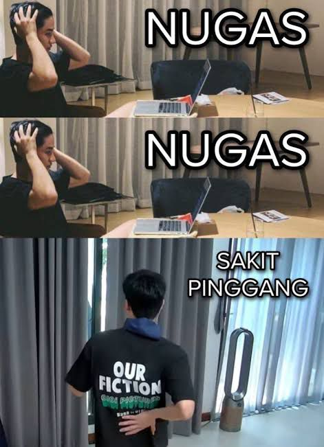
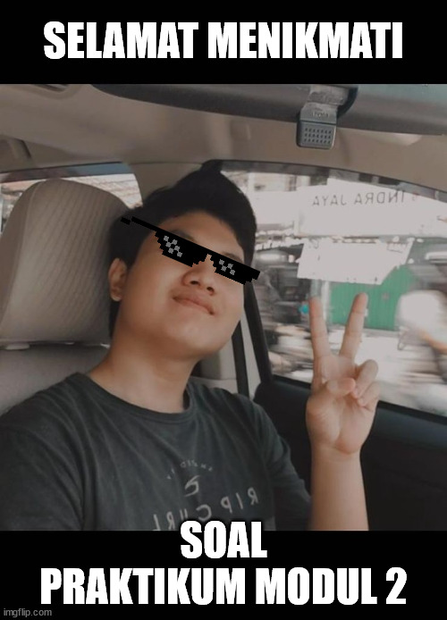

# Keadaan

Gilang dan adit yang telah menyelesaikan virtualisasi server sesuai dengan hasil rapat mereka dengan tim programmer akan mencoba menginstall beberapa aplikasi yang akan digunakan. Setelah sukses menginstall framework codeigniter beserta php5.6 dan membuat server database dengan mariadb serta phpmyadmin. Mereka akan mencoba menginstall 2 framework lain yang dibutuhkan. Tentunya, mereka akan membuat skrip instalasi secara automasi dengan ansible. Mereka cukup jumawa karena telah lulus SAS pak Aldo dengan nilai A.

Namun mereka diberi tahu lagi oleh programmer senior, pak Dzul. dimana ternyata ubuntu 18.04 Bionic sudah tidak disupport lagi untuk php7.4. Lantas mereka akan menggantinya dengan ubuntu 20.04 focal.

# Soal Praktikum

1. Rubah LXC landing dengan ubuntu focal (destroy n create, same ip, same name)
2. Rubah LXC php7 dengan ubuntu focal (destroy n create, same ip, same name)
3. vm.local/

   - akan diinstall menggunakan framework laravel 8 pada lxc_landing

   - laravel 8 menggunakan php7.4

   - tentunya harus bisa connect ke server database (lxc_mariadb)

   - semua script instalasi tidak ada yang manual (kecuali openssh-server), harus menggunakan ansible, termasuk membuat database (sungguh mereka jumawa sekali)

4. vm.local/blog

   - install wordpress terbaru pada lxc_php7.4
   - wordpress menggunakan php7.4
   - tentunya harus bisa connect ke server database (lxc_mariadb)
   - semua script instalasi tidak ada yang manual (kecuali openssh-server), harus menggunakan ansible, termasuk membuat database (sungguh mereka jumawa sekali)
   - Bisa masuk dashboard

