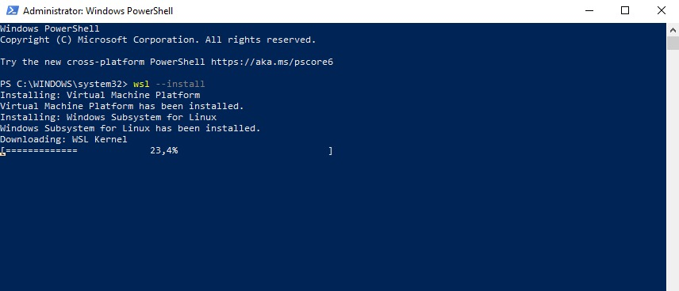
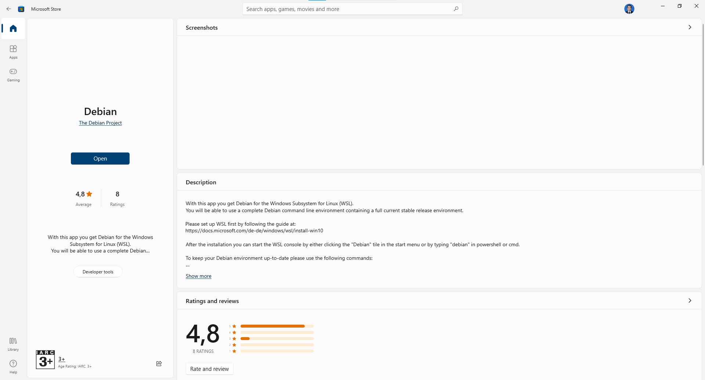
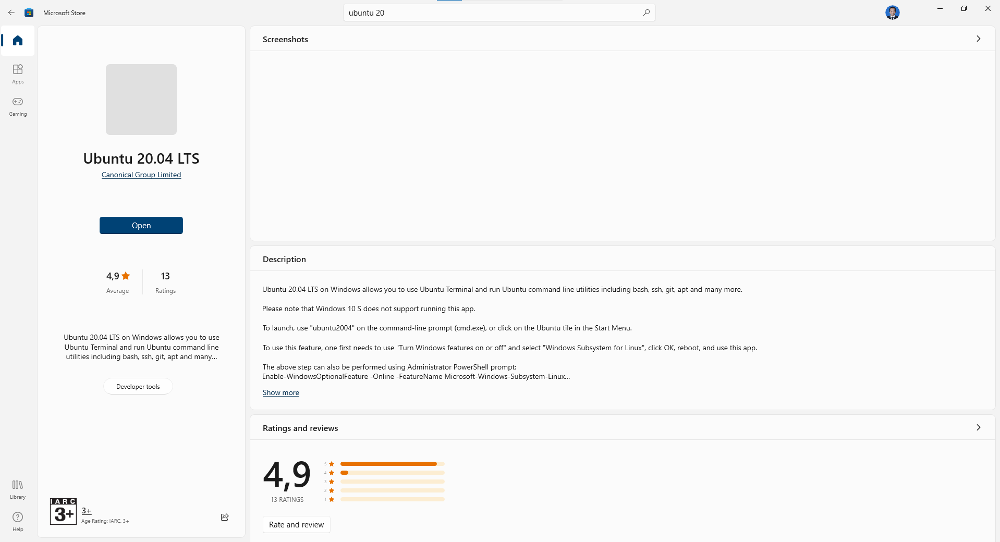
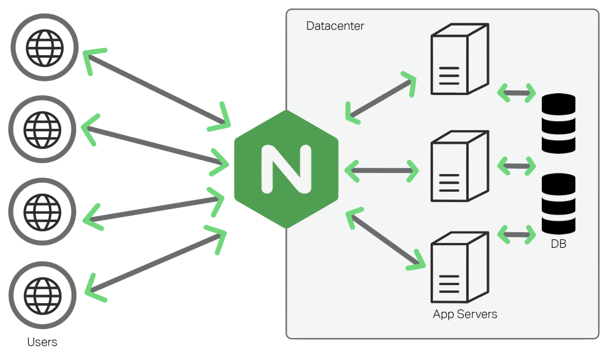

# Modul 3 - Virtualisasi WSL, DNS, & Load Balancer

## WSL (*Windows Subsystem for Linux*)
### Pengertian
Sebuah perangkat lunak yang memungkinkan para developers menjalankan peintah-perintah GNU/Linux di Windows. Perangkat lunak ini bisa berupa perintah baris, utilitas atau aplikasi, langsung pada Windows. Jadi seolah-olah seperti menggabungkan dua OS sekaligus yaitu Linux di dalam Windows.
### Instalasi WSL2
#### Instal Kernel wsl2
buka powershell as admin dan ketik
```ps 
wsl --install 
```

lantas restart laptop 

#### Install Debian dari microsoft store

#### Install Ubuntu Focal dari microsoft store


### References
* https://febryanramadhan.medium.com/apa-itu-wsl-windows-subsystem-for-linux-dan-cara-update-ke-wsl2-655c0eae98bf

## DNS (*Domain Name Server*)
### Pengertian
DNS (Domain Name System) adalah sistem penamaan untuk semua device (smartphone, computer, atau network) yang terhubung dengan internet. DNS Server berfungsi menerjemahkan nama domain menjadi alamat IP. DNS dibuat guna untuk menggantikan sistem penggunaan file host yang dirasa tidak efisien.
### Cara Kerja

Client akan meminta alamt IP dari suatu domain ke DNS server. Jika pada DNS server data alamat IP dari DNS server tersebut ada maka akan di return alamat IP nya kembali menuju client. Jika DNS server tersebut tidak memiliki alamat IP dari domain tersebut maka dia akan bertanya kepada DNS server yang lain sampai alamat domain itu ditemukan.	
### Aplikasi DNS Server
aplikasi BIND9 sebagai DNS server, karena BIND(Berkley Internet Naming Daemon) adalah DNS server yang paling banyak digunakan dan juga memiliki fitur-fitur yang cukup lengkap.
### List DNS Record
| Tipe          | Deskripsi                     |
| ------------- |:-----------------------------|
| A             | Memetakan nama domain ke alamat IP (IPv4) dari komputer hosting domain|
| AAAA          | AAAA record hampir mirip A record, tapi mengarahkan domain ke alamat Ipv6|
| CNAME         | Alias ​​dari satu nama ke nama lain: pencarian DNS akan dilanjutkan dengan mencoba lagi pencarian dengan nama baru|
| NS            | Delegasikan zona DNS untuk menggunakan authoritative name servers yang diberikan|
| PTR           | Digunakan untuk Reverse DNS (Domain Name System) lookup|
| SOA           | Mengacu server DNS yang mengediakan otorisasi informasi tentang sebuah domain Internet|
| TXT           | Mengijinkan administrator untuk memasukan data acak ke dalam catatan DNS, catatan ini juga digunakan di spesifikasi Sender Policy Framework|
### SOA (Start of Authority)
Adalah informasi yang dimiliki oleh suatu DNS zone.

| Nama          | Deskripsi                     |
| ------------- |:-----------------------------|
| Serial        | Jumlah revisi dari file zona ini. Kenaikan nomor ini setiap kali file zone diubah sehingga perubahannya akan didistribusikan ke server DNS sekunder manapun|
| Refresh       | Jumlah waktu dalam detik bahwa nameserver sekunder harus menunggu untuk memeriksa salinan baru dari zona DNS dari nameserver utama domain. Jika file zona telah berubah maka server DNS sekunder akan memperbarui salinan zona tersebut agar sesuai dengan zona server DNS utama|
| Retry         | Jumlah waktu dalam hitungan detik bahwa nameserver utama domain (atau server) harus menunggu jika upaya refresh oleh nameserver sekunder gagal sebelum mencoba refresh zona domain dengan nameserver sekunder itu lagi|
| Expire        | Jumlah waktu dalam hitungan detik bahwa nameserver sekunder (atau server) akan menahan zona sebelum tidak lagi mempunyai otoritas|
| Minimum       | Jumlah waktu dalam hitungan detik bahwa catatan sumber daya domain valid. Ini juga dikenal sebagai TTL minimum, dan dapat diganti oleh TTL catatan sumber daya individu|
| TTL           | (waktu untuk tinggal) - Jumlah detik nama domain di-cache secara lokal sebelum kadaluarsa dan kembali ke nameserver otoritatif untuk informasi terbaru|

### Latihan
#### 
### References
* https://computer.howstuffworks.com/dns.htm
* http://knowledgelayer.softlayer.com/faq/what-does-serial-refresh-retry-expire-minimum-and-ttl-mean
* https://en.wikipedia.org/wiki/List_of_DNS_record_types
* https://kb.indowebsite.id/knowledge-base/pengertian-catatan-dns-atau-record-dns/
* https://github.com/arsitektur-jaringan-komputer/Modul-Jarkom-old/blob/master/Jarkom-2018-2/Modul2-DNS-dan-Webserver/DNS/README.md

------

## Load Balancer
### Dasar Teori
#### Web Server
Web Server adalah perangkat yang menyediakan layanan akses kepada pengguna melalui protokol HTTP atau HTTPS melalui aplikasi web.
#### Load Balancing
Load balancing adalah suatu mekanisme penyeimbangan beban yang bekerja dengan cara membagi beban pekerjaan. Load balancer adalah aplikasi atau alat yang bertugas untuk melakukan load balancing . Load balancer dapat meggunakan berbagai macam algoritma load balancing yang bertujuan untuk membagi beban pekerjaan seadil-adilnya. Minimal arsitektur load balancing adalah sebagai berikut:

### Kenapa dibutuhkan load balancing?
Untuk menangani banyaknya pengguna yang mengakses layanan pada satu waktu dan menjaga layanan tetap tersedia setiap saat, dibutuhkan lebih dari satu komputer untuk memasang layanannya. Dengan layanan yang tersedia di banyak server, dibutuhkan mekanisme pembagian beban untuk memberikan beban yang seimbang pada setiap server. Dengan meletakkan layanan pada beberapa server dan pembagian beban yang optimal, setiap permintaan pengguna bisa ditangani dengan efisien.


## Selamat Menunggu Soal Praktikum :)


