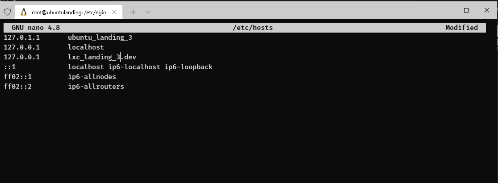
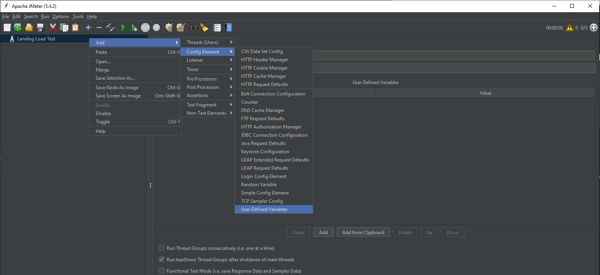

# Modul 4 - Web Server, Load Balancing dan uji performansi

## Dasar Teori

### Web Server
Web Server adalah perangkat yang menyediakan layanan akses kepada pengguna melalui protokol HTTP atau HTTPS melalui aplikasi web.

### Load balancing
Load balancing adalah suatu mekanisme penyeimbangan beban yang bekerja dengan cara membagi beban pekerjaan. Load balancer adalah aplikasi atau alat yang bertugas untuk melakukan load balancing . Load balancer dapat meggunakan berbagai macam algoritma load balancing yang bertujuan untuk membagi beban pekerjaan seadil-adilnya. Minimal arsitektur load balancing adalah sebagai berikut:


#### Kenapa dibutuhkan load balancing?
Untuk menangani banyaknya pengguna yang mengakses layanan pada satu waktu dan menjaga layanan tetap tersedia setiap saat, dibutuhkan lebih dari satu komputer untuk memasang layanannya. Dengan layanan yang tersedia di banyak server, dibutuhkan mekanisme pembagian beban untuk memberikan beban yang seimbang pada setiap server. Dengan meletakkan layanan pada beberapa server dan pembagian beban yang optimal, setiap permintaan pengguna bisa ditangani dengan efisien.

#### Nginx Load Balancing
Load Balancing di beberapa instans aplikasi adalah teknik yang umum digunakan untuk mengoptimalkan pemanfaatan sumber daya, memaksimalkan throughput, mengurangi latensi, dan memastikan konfigurasi yang toleran terhadap kesalahan.

Dimungkinkan untuk menggunakan nginx sebagai Load Balancer HTTP yang sangat efisien untuk mendistribusikan lalu lintas ke beberapa server aplikasi dan untuk meningkatkan kinerja, skalabilitas, dan keandalan aplikasi web dengan nginx.

Mekanisme (atau metode) Load Balancing berikut didukung di nginx:
1. Round Robin

	permintaan ke server aplikasi didistribusikan secara round-robin
	
	```sh
	http {
	    upstream myapp1 {
	        server srv1.example.com;
	        server srv2.example.com;
	        server srv3.example.com;
	    }
	
	    server {
	        listen 80;
	
	        location / {
	            proxy_pass http://myapp1;
	        }
	    }
	}
	```

2. Least Connection

	permintaan berikutnya diberikan ke server dengan jumlah koneksi aktif paling sedikit
	
	```sh
	http {
	    upstream myapp1 {
	    	least_conn;
	        server srv1.example.com;
	        server srv2.example.com;
	        server srv3.example.com;
	    }
	
	    server {
	        listen 80;
	
	        location / {
	            proxy_pass http://myapp1;
	        }
	    }
	}
	```

3. Ip Hash

	fungsi hash digunakan untuk menentukan server apa yang harus dipilih untuk permintaan berikutnya (berdasarkan alamat IP klien).
	```sh
	http {
	    upstream myapp1 {
	    	ip_hash;
	        server srv1.example.com;
	        server srv2.example.com;
	        server srv3.example.com;
	    }
	
	    server {
	        listen 80;
	
	        location / {
	            proxy_pass http://myapp1;
	        }
	    }
	}
	```

4. Weighted Load Balancing

	Hal ini juga memungkinkan untuk mempengaruhi algoritma load balancing nginx lebih jauh dengan menggunakan bobot server.
	
	Dengan round-robin khususnya itu juga berarti distribusi permintaan yang kurang lebih sama di seluruh server — asalkan ada permintaan yang cukup, dan ketika permintaan diproses secara seragam dan diselesaikan dengan cukup cepat.
	
	Ketika parameter bobot ditentukan untuk server, bobot diperhitungkan sebagai bagian dari keputusan penyeimbangan beban.


	```sh
	http {
	    upstream myapp1 {
	        server srv1.example.com weight=3;
	        server srv2.example.com;
	        server srv3.example.com;
	    }
	
	    server {
	        listen 80;
	
	        location / {
	            proxy_pass http://myapp1;
	        }
	    }
	}
	```

### Uji Performansi
pengujian kinerja didefinisikan sebagai jenis pengujian perangkat lunak untuk memastikan aplikasi perangkat lunak yang akan bekerja dengan baik di bawah beban kerja yang diharapkan.

#### Load Testing
teknik performance testing dengan mengukur respon sistem dalam berbagai load condition. Penelitian ini membantu menentukan bagaimana software berperilaku ketika beberapa user mengakses software secara bersamaan

#### Stress Testing
Stress testing juga dikenal sebagai pengujian daya tahan untuk menentukan batas, di mana sistem atau perangkat lunak atau perangkat keras rusak. Hal ini juga untuk memastikan sistem berjalan efektif meskipun dalam kondisi ekstrem

### Apache JMeter


Aplikasi Apache JMeter™ adalah perangkat lunak sumber terbuka, aplikasi Java murni 100% yang dirancang untuk memuat perilaku fungsional pengujian dan mengukur kinerja. Ini pada awalnya dirancang untuk menguji Aplikasi Web tetapi sejak itu diperluas ke fungsi pengujian lainnya.

## Latihan

### Load Balancing
1. Siapkan LXC untuk landing
	* Clone LXC ubuntu_landing menjadi ubuntu_landing_2 dan ubuntu_landing_3
	
		```sh
		sudo lxc-stop -n ubuntu_landing
		sudo lxc-copy -n ubuntu_landing -N ubuntu_landing_2 -sKD
		sudo lxc-copy -n ubuntu_landing -N ubuntu_landing_3 -sKD
		```
		
		
		
	* Start LXC 
	
		```sh
		sudo lxc-start -n ubuntu_landing
		sudo lxc-start -n ubuntu_landing_2
		sudo lxc-start -n ubuntu_landing_3
		```
		
	* Masuk ke lxc ubuntu_landing_2
	
		```sh
		sudo lxc-attach -n ubuntu_landing_2
		```
		
	* Configurasi IP dan nginx ubuntu_landing_2
	
		```sh
		nano /etc/netplan/10-lxc.yaml
		```
		
		ganti ip menjadi 10.0.3.113
		
		
		
		terapkan konfigurasi netplan baru
		
		```sh
		netplan apply
		```
		
		check ip
		
		```sh
		ip addr show eth0
		```
		
		
		
		Daftarkan domain lxc_landing_2.dev di hosts file
		
		```sh
		nano /etc/hosts
		```
		
		
		
		Konfigurasi nginx untuk lxc_landing_2.dev
		
		```sh
		nano /etc/nginx/sites-available/lxc_landing.dev
		```
		
		
		
		Check configurasi nginx dan start nginx
		
		```sh
		nginx -t
		service nginx restart
		```
		
		Coba akses lxc_landing
		
		```sh
		curl -i http://lxc_landing_2.dev
		```
		
		
		
		keluar dari ubuntu_landing_2
		
		```sh
		exit
		```
		
	* Masuk ke lxc ubuntu_landing_3
	
		```sh
		sudo lxc-attach -n ubuntu_landing_3
		```
		
	* Configurasi IP dan nginx ubuntu_landing_2
	
		```sh
		nano /etc/netplan/10-lxc.yaml
		```
		
		ganti ip menjadi 10.0.3.123
		
		
		
		terapkan konfigurasi netplan baru
		
		```sh
		netplan apply
		```
		
		check ip
		
		```sh
		ip addr show eth0
		```
		
		
		
		Daftarkan domain lxc_landing_3.dev di hosts file
		
		```sh
		nano /etc/hosts
		```
		
		
		
		Konfigurasi nginx untuk lxc_landing_3.dev
		
		```sh
		nano /etc/nginx/sites-available/lxc_landing.dev
		```
		
		
		
		Check configurasi nginx dan start nginx
		
		```sh
		nginx -t
		service nginx restart
		```
		
		Coba akses lxc_landing
		
		```sh
		curl -i http://lxc_landing_3.dev
		```
		
		
		
		exit dari ubuntu_landing_3
		
		```sh
		exit
		```
		 
2. Setup Nginx

	* Daftarkan lxc_landing_2.dev dan lxc_landing_3.dev ke hostfile vm.local
	
		```sh
		sudo nano /etc/hosts
		```
		
		
		
	* Check lxc_landing_2.dev dan lxc_landing_3.dev melalui curl
	
		```sh
		curl -I http://lxc_landing_2.dev
		curl -I http://lxc_landing_3.dev
		```
		
		

	* Konfigurasi load balancer menggunakan round robin untuk halaman landing vm.local pada nginx
	
		```sh
		sudo nano /etc/nginx/sites-available/vm.local
		```
		
		
		
	* Check Konfigurasi nginx
	
		```sh
		sudo nginx -t
		```
		
		
		
	* Restart Nginx
	
		```sh
		sudo service nginx restart
		```
	
3. Coba Jalankan
	
	* Coba akses vm.local
	
		```sh
		curl -I http://vm.local
		```
		
		
		

### Load Testing
1. Daftarkan vm.local ke /etc/hosts sesuai IP masing-masing, menggunakan DNS hasil modul 3 lebih disarakan
	
	
	
2. Install Apache JMeter
	
	* Pastikan java sudah terinstall, apabila belum silahkan install java terlebih dahulu

		```sh
		java -version
		```
		
		
		
	* [Download](https://jmeter.apache.org/download_jmeter.cgi "Download ") Apache Jmeter
	
		
		
	* Extract Files dan jalankan apache Jmeter (apache-jmeter-5.4.2/bin/jmeter.bat)
	
		
		
2. Konfigurasi

	* Rename test plan menjadi Landing Load Test
	
		
		
	* Menambahkan User Defined VariablesPermalink
	
		Di node ini kita akan menambahkan informasi global yang sering digunakan pada saat testing seperti informasi host dan port. Untuk menambahkan node `User Defined Variables` klik kanan node Test Plan (Landing Load Test) -> Add -> Config Element -> User Defined Variables.
		
		
		
		Tambahkan host dan port seperti gambar dibawah ini
		
		
		
	* Menambahkan Thread Group
	
		Setelah menambahkan node User Defined Variables, kita lanjutkan dengan  menambahkan trafik/user visitor ke dalam komponen yang mau di test.
		
		
		
		
		
		Keterangan:
		
			- Number of threads (users) : 
				isi berapa user/visitor yang akan mengakses web.
			– Ramp-Up period ( in seconds ) : 
				isi berapa waktu delay antara user satu dengan yang lainnya dalam mengakses web.
			– Loop Count : 
				waktu eksekusi, bertahap atau seterusnya.
		
		
	* Menambahkan HTTP Request Defaults
	
		Langkah berikutnya adalah menambahkan node HTTP Request Defaults, caranya juga sama seperti sebelumnya hanya saja yang dipilih node HTTP Request Defaults. Di node ini kita cukup mengeset informasi nama server/ip address, port dan protocol.
		
		
		
		
	
	* Menambahkan Http Request untuk users access (Threads Group)
	
		Jika tidak hanya halaman utama yang di test, kita bisa menambahkan path/foldernya, caranya :
		
		
		
		Tambahkan 3 kali untuk landing, blog dan app
		
		
		
		
		
		
		
3. Menambahkan Listener
Menampilkan proses dan hasil test secara grafis atau bentuk tabel. Caranya :

	* Klik Kanan Landing Load Test
		* Add > Listener > Graph Result
		
			
		
		* Add > Listener > View Results in Table
		
			
			
		* Add > Listener > Summary Report
		
			

4. Run Testing
Menjalankan Test secara otomatis. Caranya :

	* Simpan terlebih dahulu Test Plan yang telah kita buat di File > Save ( Ctrl + S ).
	* Klik Run atau Ctrl + R, jMeter akan mulai mensimulasi sejumlah user dalam mengakses web server yang telah ditentukan.

5. Hasil

	- Graph Result
	
		
		
		
	- View Results in Table
	
		
		
	- Summary Report
	
		

## Soal Praktikum
1. Terapkan loadbalancer untuk /blog dan /app dengan ketentuan
	1. /blog menggunakan least_conn
	2. /app menggunakan ip hash
	3. disarakan menggunakan ansible untuk instalasi
2. Gunakan apache Jmeter untuk menganalisa perbedaan antara /, /app, /blog dengan loadbalancer dan tanpa loadbalancer pada traffic 50, 100 dan 150 users. Analisa dari segi waktu saja. Tulis langkah testing dan analisa dengan bahasa sendiri.

## Referensi
1. http://nginx.org/en/docs/http/load_balancing.html
2. https://jmeter.apache.org/
3. http://coding4ever.net/blog/2015/10/20/performance-test-menggunakan-jmeter/
4. https://www.youtube.com/watch?v=mXGcBvWYl-U
5. https://medium.com/doku-insight/jmeter-87cccc713733